## Vue2.0 源码学习

## 参考链接

1. [汪图南](https://wangtunan.github.io/blog/vueAnalysis/introduction/)
2. [Vue 源码分析 -- 基于 2.2.6 版本](https://github.com/liutao/vue2.0-source)
3. [Vue 源码逐行注释分析](https://github.com/qq281113270/vue)
4. [推荐 7 个 Vue2、Vue3 源码解密分析的重磅开源项目](https://juejin.cn/post/6942492146725290020#heading-5)
5. [Vue 源码解读](https://www.bilibili.com/video/BV1Jb4y1D7eA?share_source=copy_web)
6. [Vue 源码解析系列课程](https://www.bilibili.com/video/BV1iX4y1K72v?p=7&spm_id_from=pageDriver)
7. [百度云备份(c7zf)](https://pan.baidu.com/s/1QLKyi8NsLf5touOePRfTYg)

## 数据变为视图的方法

1. 纯 DOM 法

```
var arr = [
    {name: '小明'},
    {name: '小红'},
    {name: '小强'}
]
var list = document.getElementById('list');
for(var i = 0; i < arr.length; i++){
    // 每遍历一项， 都要用DOM方法去创建li标签
    let oLi = document.createElement('li');
    oLi.innerText = arr[i].name;
    // 创建的节点是孤儿节点，必须要上树才能被用户看见
    list.appendChild(oLi)
}
```

2. 数组 join 法

```
var arr = [
    {name: '小明'},
    {name: '小红'},
    {name: '小强'}
]
var list = document.getElementById('list');
// 遍历arr数组，每遍历一项，就以字符串的视角将HTML字符串添加到list中
for(var i = 0; i < arr.length; i++){
    list.innerHTML += [
    '<li>',
    '   <div class='hd'>'+ arr[i].name +'</div>',
    '   <div class='bd'>',
    '       <p>姓名:'+ arr[i].name +'</p>',
    '   </div>',
    '</li>'
 ].join('')
}
```

3. ES6 的反引号法

```
var arr = [
    {name: '小明'},
    {name: '小红'},
    {name: '小强'}
]
var list = document.getElementById('list');

for(var i = 0; i < arr.length; i++){
    list.innerHTML += `
        <li>
            <div class='hd'>${arr[i].name}</div>
            <div class='bd'>
                <p>姓名: ${arr[i].name}</p>
            </div>
        </li>
    `
}
```

4. 模板引擎

## mustache 模版引擎

将数据变为视图最优雅的解决方案

git 地址 <https://github.com/janl/mustache.js>

### 模版语法

在 BootCDN 找到 mustache 包

```
// 循环对象数组
var template = `
 <ul>
    {{#arr}}
         <li>
            <div class='hd'>{{name}}</div>
            <div class='bd'>
                <p>姓名: {{name}}</p>
            </div>
        </li>
    {{/arr}}
 </ul>
`;

var data = {
    arr: [
        {name: '小明'},
        {name: '小红'},
        {name: '小强'}
    ]
}

const domStr = Mustache.render(template, data);
const container = document.getElementById('container');
container.innerHTML = domStr;

// 不循环
const template = `
    <h1>我买了一个{{thing}},好{{mood}}</h1>
`
const data = {
    thing: '华为手机',
    mood: '开心'
}
const domStr = Mustache.render(template, data);
const container = document.getElementById('container');
container.innerHTML = domStr;

// 循环简单数组
var data = {
    arr: [
        'A','B','C'
    ]
};

// 用.代表简单数组里的元素
var template = `
    <ul>
        {{#arr}}
            <li>{{.}}</li>
        {{/arr}}
    </ul>
`
// 数组的嵌套
var template =`
    <ul>
        {{#arr}}
            <li>
              <ol>
                {{#hobbies}}
                    <li>{{.}}</li>
                {{/hobbies}}
              </ol>
            </li>
        {{/arr}}
    </ul>
`

// 布尔值
var template = `
    {{#m}}
        <h1>hello world</h1>
    {{/m}}
`
var data = {
    m: false
}

// 模版 存储字符串 不会被浏览器识别
<script type='text/template' id='template'>
     <ul>
        {{#arr}}
            <li>
              <ol>
                {{#hobbies}}
                    <li>{{.}}</li>
                {{/hobbies}}
              </ol>
            </li>
        {{/arr}}
    </ul>
</script>

const templateStr = document.getElementById('template'),innerHTML;
```

### mustache 底层核心机理

1. 简单示例情况下， 可以用正则表达式实现

```
const render = (template, data) =>
  template.replace(/\{\{(\w+)\}\}/g, (findStr, $1, index, str) => data[$1]);
```

2. 复杂情况下，mustache 实现机理

   - tokens
     - 一个 js 的嵌套数组，也就是模板字符串的 js 表示
     - 它是抽象语法树，虚拟节点等的开山鼻祖

3. mustache 库底层重点要做的两个事情

   - 将模板字符串编译为 tokens 形式
   - 将 tokens 结合数据，解析为 dom 字符串

```
  // 模板字符串
  <h1>我买了一个{{thing}}，花了{{money}}元，好{{mood}}啊</h1>

  // tokens
  [
    ["text", " <h1>我买了一个"],
    ["name","thing"],
    ["text", ",好"],
    ["name", "mood"],
    ["text","啊</h1>"]
  ]
```

mustache 流程

普通的字符串

循环情况下的 tokens

双重循环情况下的 tokens


### 手写 mustache 库

1. 使用 webpack 和 webpack-dev-server 构建
   - 模块化打包工具有 webpack(webpack-dev-server),rollup,Parcel 等
   - mustache 官方库使用 rollup 进行模块化打包,而我们使用 webpack 进行模块化打包
   - 生成库是 `UMD` 的，这意味着他可以同时在 nodejs 环境中使用，也可以在浏览器环境中使用，实现 UMD 不难，只需要一个"通用头"
2. 注意 webpack 和 webpack-dev-server 的版本

   webpack 最新版是 5，webpack-dev-server 最新版本是 4，但是目前他的兼容性不好，所以建议使用下面的版本
   

3. 配置 webpack.config.js
   

## 虚拟 DOM 和 diff 算法

### 虚拟 DOM

将真实 DOM 转化为 js 对象

用 JavaScript 对象描述 DOM 的层次结构，DOM 中的一切属性都在虚拟 DOM 中有对应的属性


### diff 算法

diff 是发生在虚拟 DOM 上的
新虚拟 DOM 和老虚拟 DOM 进行 diff(精细化比较)，算出应该如何最小量更新，最后反映到真正的 DOM 上。

### snabbdom 简介

著名的虚拟 DOM 库，是 diff 算法的鼻祖，Vue 源码借鉴了 snabbdom

### snabbdom 测试环境搭建

1.  snabbdom 库是 DOM 库，所以不能在 nodejs 环境中允许，需要搭建 webpack 和 webpack-dev-server 开发环境，并且不需要安装任何 loader
2.  必须安装最新版 webpack@5，因为 webpack@4 没有读取身份证中 exports 的能力
    `npm i -D webpack@5 webpack-cli@3 webpack-dev-server@3`

3.  参考 webpack 官网，书写好 webpack.config.js 文件

### snabbdom 的 h 函数如何工作

1. 用来产生虚拟节点(vnode)

   ```
   比如调用 h 函数
   @params 标签名字
   @params 对象,各种属性
   @params 文本
   h('a', {props: {href: 'http://www.baidu.com'}}, '百度')

   将得到这样的虚拟节点
   {'sel': 'a', 'data': { props: { href: 'http://www.baidu.com'}}, 'text': '百度'}

   它表示真正的DOM节点
   <a href='http://www.baidu.com'>百度</a>
   ```

2. h 函数可以嵌套使用，从而得到虚拟 DOM 树

   ```
    比如这样嵌套使用 h 函数
    h('ul', {}, [
        h('li', {}, '牛奶'),
        h('li', {}, '咖啡'),
        h('li', {}, '可乐'),
    ])

    将得到这样的虚拟DOM树
    {
        'sel': 'ul',
        'data': {},
        'children': [
            { 'sel': 'li', 'text': '牛奶'},
            { 'sel': 'li', 'text': '咖啡'},
            { 'sel': 'li', 'text': '可乐'},
        ]
    }
   ```

### 一个虚拟节点有那些属性

```
{
    children: undefined, // 子元素
    data: {},  // 本身带的属性 样式等等
    elm: undefined,  // 这个元素对应的真正的dom节点， undefined表示还没有上树渲染
    key: undefined, // 这个节点的唯一标识
    sel: 'div', // 选择器
    text: '我是一个盒子' // 文本
}
```

### diff 算法原理

#### 感受 diff 算法

1. key 很重要，key 是这个节点的唯一标识，告诉 diff 算法，在更改前后它们是同一个 DOM 节点
2. 只有是同一个虚拟节点，才进行精细化比较，否则就是暴力删除旧的，插入新的。
   - 延伸问题： 如何定义是同一个虚拟节点？
   - 选择器相同且 key 相同
3. 只进行同层比较，不会进行跨层比较。 即使是同一个虚拟节点，但是跨层了，就不进行精细化比较，而是暴力删除旧的，然后插入新的
   

4. 2,3 操作在实际开发中基本不会出现，所以这是合理的优化机制

#### patch 函数被调用(流程图)


#### 如何定义同一个节点


旧节点的 key 要和新节点的 key 相同且旧节点的选择器要和新节点的选择器相同

#### 创建节点时， 所有子节点需要递归创建


#### oldVnode 和 newVnode 是同一个节点


oldVnode 和 newVnode 有子节点

- 新增的情况
  

#### diff 算法的子节点更新策略

四种命中查找

新前： 新的虚拟节点所有没有处理的开头的节点
新后： 新的虚拟节点没有处理的最后的节点

算法按照如下顺序

1. 新前与旧前
2. 新后与旧后
3. 新后与旧前(新前指向的节点移动到旧后之后)
4. 新前与旧后(新前指向的节点移动到旧前之前)

命中一种就不再进行命中判断

如果都没命中，那就需要用循环来查找了,移动到 oldStartIndex 之前


- 新增的情况

比较新前与旧前，命中第一种，新前与旧前下移
while(新前<=新后&&旧前<=旧后) // 循环判断
如果是旧节点先循环完毕，说明新节点中有要插入的节点

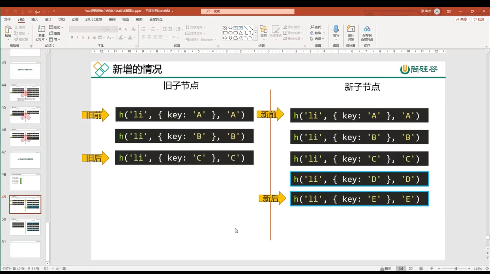


- 删除的情况

如果是新节点先循环完毕，如果老节点中有剩余节点(旧前和旧后指针中间的节点)，说明他们是要被删除的节点


- 多删除的情况


- 复杂情况

1. 当新前与旧后命中的时候，此时要移动节点。移动新前指向的这个节点到老节点的旧前的前面
2. 当新后与旧前命中的时候，此时要移动节点。移动新前指向的这个节点到老节点的旧后的后面


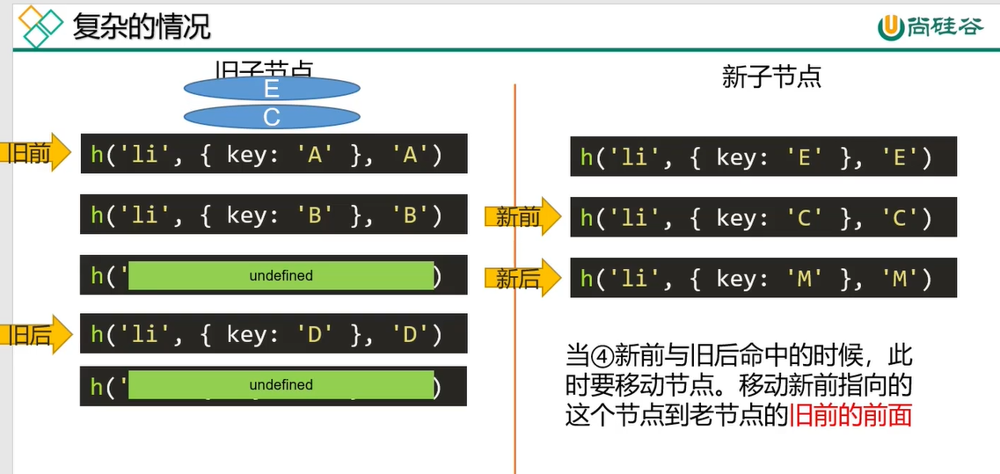
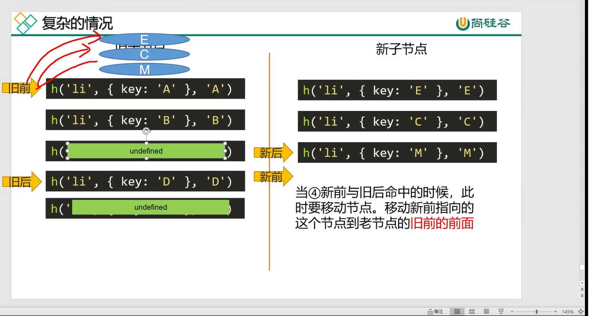

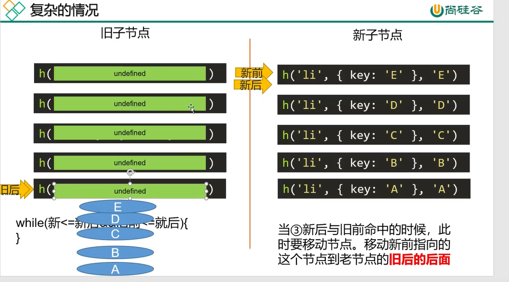

## 数据响应式原理

### MVVM 模式

数据变化，视图也会自动变化


### 侵入式和非侵入式

1. 侵入式(需要调用框架提供的 api 修改数据的值)

2. 非侵入式(不需要调任何 Api,直接改变对象属性)


### Vue 利用 Object.defineProperty()实现数据响应式


### 详解 Object.defineProperty()

1. 定义： 直接在一个对象上定义一个新属性，或者修改一个对象的属性，并返回此对象
2. Object.defineProperty() 可以设置隐藏属性

```
const o = {};
Object.defineProperty(o, "a", {
  value: 3,
  // 是否可写
  writable: false
});
Object.defineProperty(o, "b", {
  value: 5,
  // 是否可以被枚举,循环读取不到来
  enumerable: false
});
console.log(o);
```

3. get 函数和 set 函数
   get 进行数据劫持
   set 进行数据更新

getter/setter 需要变量中转才能工作

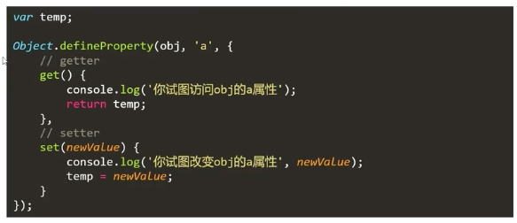

### defineReactive 函数

```
const o = {};

function defineReactive(data, key, val) {
  /**构造闭包环境 */
  Object.defineProperty(o, "a", {
    /**可枚举 */
    enumerable: true,
    /**可以被配置，比如可以被delete */
    configurable: true,
    /**数据劫持 getter */
    get() {
      console.log("试图访问a属性");
      return val;
    },
    /**setter */
    set(newValue) {
      console.log("你试图改变a属性", newValue);
      if (val === newValue) return;
      val = newValue;
    },
  });
}
defineReactive(o, "a", 10);
```

### 递归侦测对象的全部属性


### 数组的响应式处理

vue 底层改了数组的七个方法

1. push
2. pop
3. shift
4. unshift
5. splice
6. sort
7. reverse

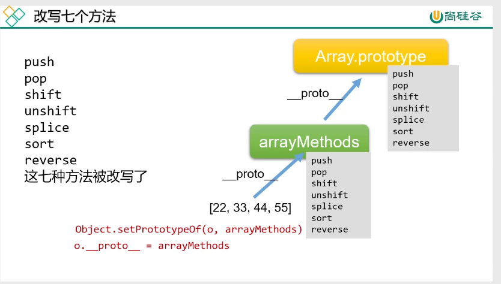

### 依赖收集

1. 什么是依赖

需要用到数据的地方，称为依赖

vue1.x，细粒度依赖，用到数据的 DOM 都是依赖

vue2.x，中等粒度依赖，用到数据的组件是依赖

在 getter 中收集依赖，在 setter 中触发依赖

2. Dep 类

把依赖收集的代码封装称 Dep 类，专门用来管理依赖，每个 Observer 的实例，成员中都有一个 Dep 的实例

Dep 使用发布订阅模式，当数据发生改变中，会循环依赖列表，把所以的 Watch 都通知一遍

3. Watcher 类

Watch 是一个中介，数据发生变化是通过 Watch 中转，通知组件

依赖就是 Watcher。 Watcher 触发的 getter 才会收集依赖，哪个 Watch 触发了 getter，就把哪个 Watcher 收集到 Dep 中

4.  代码实现的巧妙之处

Watcher 把自己设置到全局的一个指定的位置，然后读取数据

因为读取了数据，所以会触发这个数据的 getter，在 getter 中就能得到当前正在读取数据的 Watcher，并把 Watcher 收集到 Dep 中

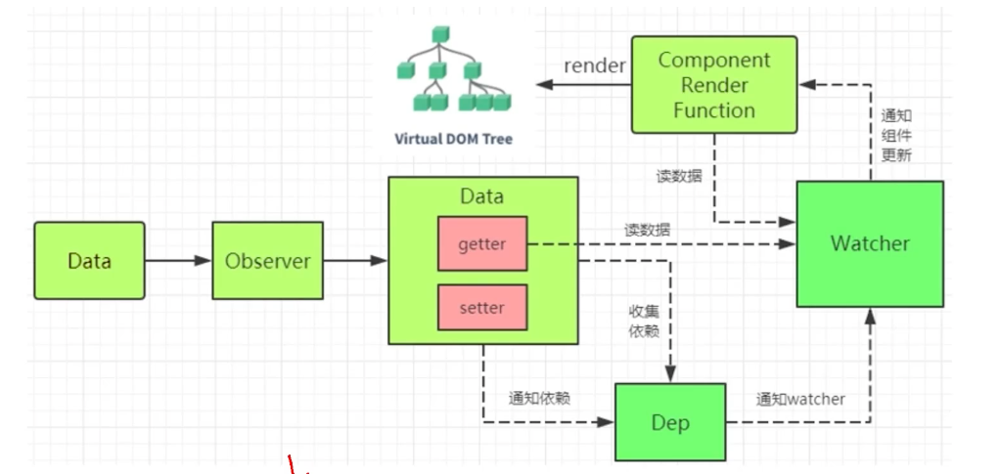

## AST 抽象语法树

通过抽象语法树对模板编译进行过渡让编译工作变得简单

本质就是一个 JS 对象

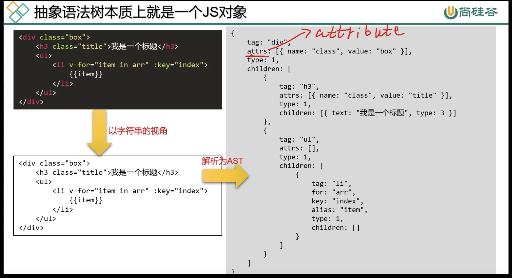

### 抽象语法树和虚拟节点的关系

模板语法会变成抽象语法树 AST 然后变为渲染函数(h 函数)


### 涉及相关算法

1. 栈

   - 又叫堆栈，一种运算受限的线性表，仅在表位能进行插入和删除的操作， 这一端被称为栈顶，相对的另一端称为栈底

   - 向一个栈插入新元素又称作进栈、入栈或压栈；从一个栈删除元素， 又称作出栈或退栈

   - 后进先出（LIFO）特点： 栈中的元素，最先进栈的必定是最后出栈，后进栈的一定会先出栈

   - JavaScript 中， 栈可以用数组模拟，需要限制只能使用 push 和 pop，不能使用 unshift 和 shift，即数组尾是栈顶

   - 可以用面向对象等手段，将栈封装得更好

   - 遇到词法分析的时候，经常要用到栈这个数据结构

   尝试编写"智能重复"smartRepeat 函数实现

   - 将 3[abc]变为 abcabcabc
   - 将 3[2[a]2[b]]变为 aabbaabbaabb
   - 将 2[1[a]3[b]2[3[c]4[d]]]变为 abbbcccddddcccddddabbbcccddddccdddd

   不用考虑输入值非常是非法的情况

   - 2[a3[b]]是错误的，应该补一个 1，即 2[1[a]3[b]]
   - [abc]是错误的，应该补一个 1，即 1[abc]

   - 解题思路

     - 遍历每个字符串
     - 如果这个字符是数字，那么就把数字压栈，把空字符串压栈
     - 如果这个字符是字母，那么此时就把栈顶这项改为这个字母
     - 如果这个字符是]，那么就将数组弹栈，就把字符栈的栈顶的元素重复刚刚的这个次数，弹栈，拼接到新栈顶上

2. 指针

   - 指针就是下标

   - 尝试寻找字符串中连续重复次数最多的字符

   如果 i 和 j 指向的字一样，那么 i 不动, j 后移

   如果 i 和 j 指向的字不一样，此时说明他们之前的字都是连续相同的，让 i 追上 j，j 后移

3. 递归

   - 遇到"规则复现"就要想到递归

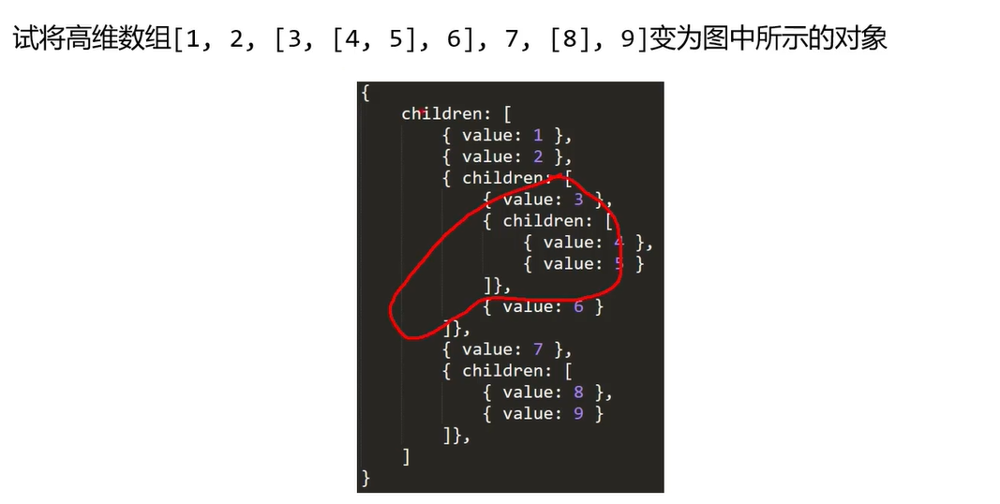

### 关于正则的相关方法

1. replace
2. search
3. match
4. test

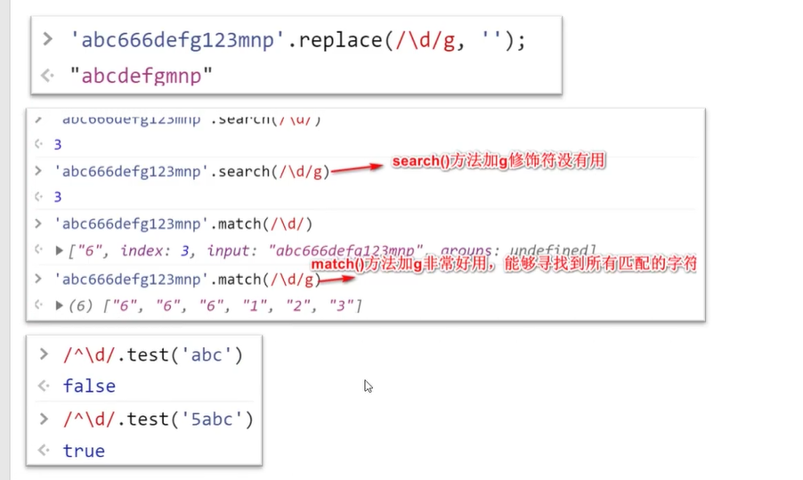
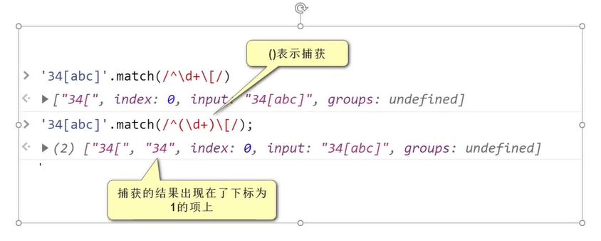

### 手写 AST 编译器

### 手写文本解析功能

### AST 优化

### 将 AST 生成 h 函数
